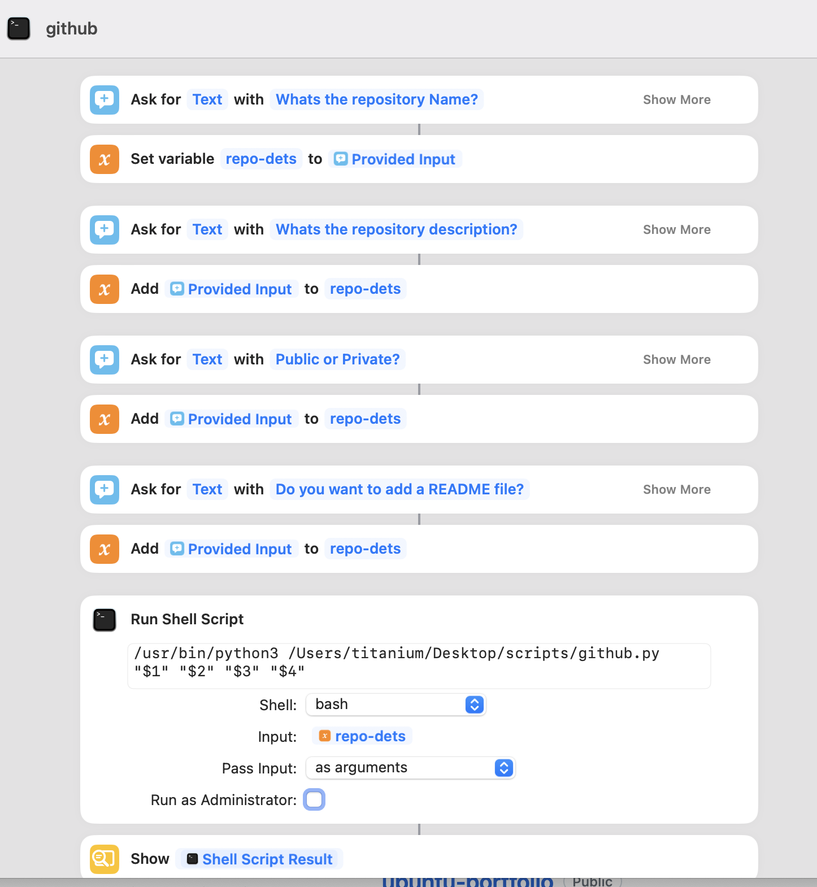

# Installation instructions

- Clone this repository.
- Create a macOS shortcut using the screenshot below:
  - 
- In the shortcut edit the final script path of the script with the path where your script is saved.
- In the script add your own github personal access token.
  
## How to run from either Spotlight or Alfred
- Right click on the shortcut and says "Add to Dock" (this basically turns the shortcut into an applicaiton).
- Now you can remove the app from the dock and just run it via spotlight or Alfred.
